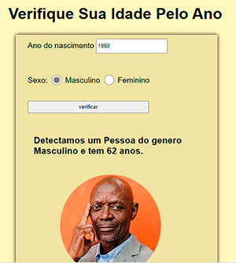

# Projeto Verificador de Idade
#

<h3>#HTML  #CSS   #JAVASCRIPT </h3>

 

### Projeto verificador de idade é um projeto com tela responsiva que o usuario digita o ano de nascimento e o gênero e ele mostra a idade e  uma foto correspondente.
#
#
## Objetivo:
#### Praticar javascript, onde o desafio era pegar dois elemento por nome e criar um id e um img direto no javascript.
#
#

    <table>
    <tr>
        <td>
            
#Tela Celular
 
                
        </td>
        <td>
            
        </td>
        <td>
            
#Tela Desktop
 
            
        </td>
    </tr>
    </table>

    

